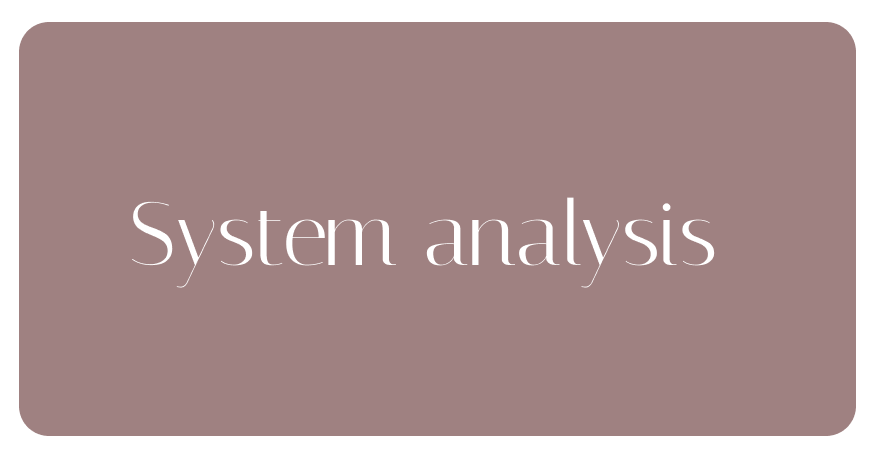
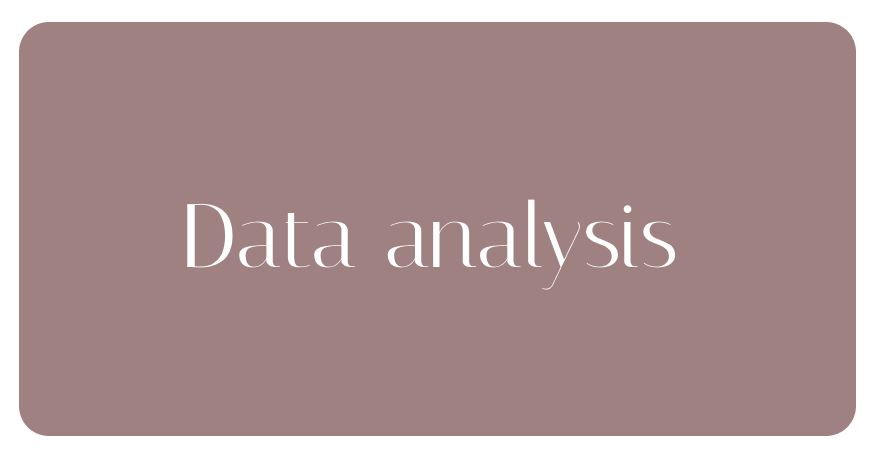

# 👩‍💻 Системный аналитик

Привет! Я **Кристина**. Проектирую ИТ-решения, которые помогают бизнесу расти, а команде - работать без хаоса.

---

## 🚀 Обо мне

Выбрала системный анализ, потому что люблю соединять **бизнес-логику и техническую реализацию**. Моя суперсила - «аналитическая эмпатия»: глубоко понимаю боли пользователей и превращаю их в понятные требования.

**Почему я?**
- 9 месяцев опыта → сократила время разработки на **30-40%** за счёт чёткой декомпозиции
- Самостоятельно валидирую гипотезы на данных (SQL + Python)
- Документация всегда понятна всем: от заказчика до разработчика

---

## 🛠 Технологический стек

**Анализ и проектирование** 📝 BPMN 2.0 • UML • ER • DFD  
SRS • Use Cases • User Stories  
Jira • Confluence • Figma • Draw.io • Miro

**API и интеграции** 🔌 REST API (JSON, XSD)  
Postman • Swagger

**Работа с данными** 🗄️ SQL (сложные запросы)  
🐍 Python + Pandas (Jupyter Notebook)

---
## 📂 Мои репозитории и портфолио

Ниже собраны мои практические работы по трём ключевым направлениям. Кликайте на карточки, чтобы перейти в репозиторий:

  
  <a href="https://github.com/saponikk06/Practicum-System-Analysis_projects" style="text-decoration: none; flex: 1 1 300px; max-width: 320px;">
    
    

      <strong>System analysis</strong>
    

  </a>

  <a href="https://github.com/saponikk06/Business-Analysis-Cases" style="text-decoration: none; flex: 1 1 300px; max-width: 320px;">
    
    

      <strong>Business analysis</strong>
    

  </a>

  <a href="https://github.com/saponikk06/Data-Analysis-Portfolio" style="text-decoration: none; flex: 1 1 300px; max-width: 320px;">
    
    

      <strong>Data analysis</strong>
    

  </a>

### 📌 Ключевые проекты внутри репозиториев:

* ⚙️ **[System Analysis](https://github.com/saponikk06/Practicum-System-Analysis_projects)**: 
    * 🏠 **Smart Home** — архитектура MVP и модель данных «Stets Home».
    * 🎓 **EdTech** — SRS + интеграции «Chatty 2.0».
    * 🛒 **E-commerce** — бизнес-правила платежей «Накарабине».
    * 🎬 **Streaming** — REST API и ТЗ на микросервисы «Otium».
* 💼 **[Business Analysis](https://github.com/saponikk06/Business-Analysis-Cases)**: 
    * Концепция и BPMN-схема приложения «Т-Спорт».
    * Финансовое моделирование и анализ метрик для монетизации VK Video.
* 📊 **[Data Analysis](https://github.com/saponikk06/Data-Analysis-Portfolio)**: 
    * Скрипты и тетрадки (Jupyter Notebook) с проверкой гипотез, обработкой массивов данных и SQL-запросами.

---

## 📬 Контакты и статус

📍 **Москва** (гибрид или полная удалёнка)  
💼 **Открыта к предложениям** (full-time / стажировка)  
✈️ **Telegram**: [@saponik](https://t.me/saponik)  
📧 **Email**: [krss.az@yandex.ru](mailto:krss.az@yandex.ru)

---

*Ежедневно прокачиваюсь на Codewars и совершенствую системное мышление.*
